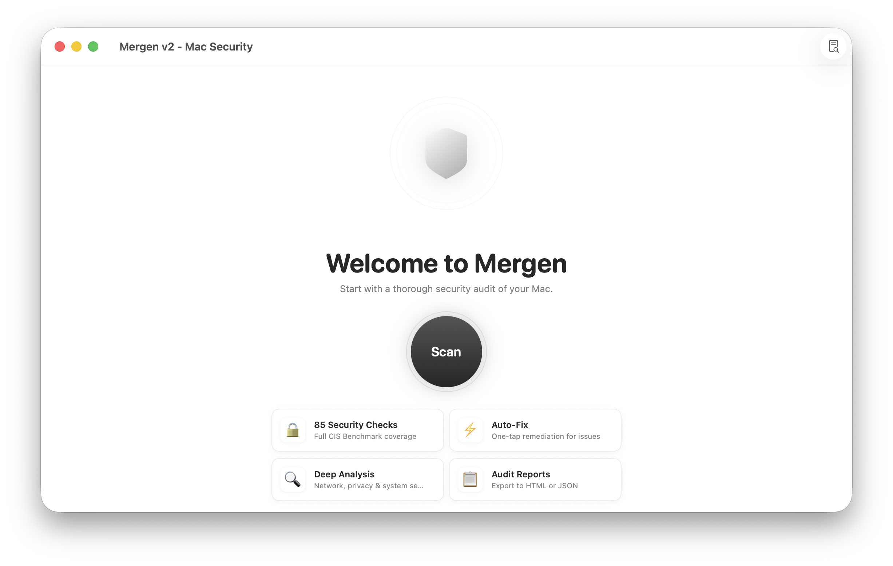
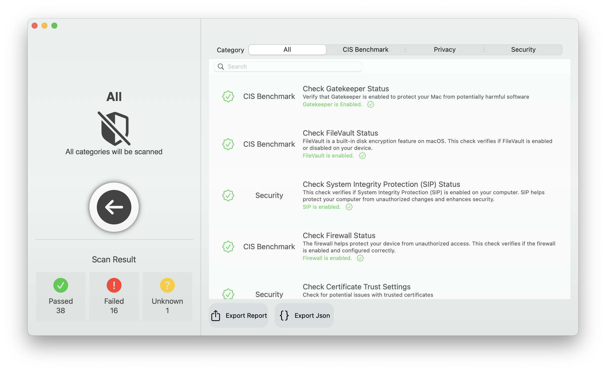
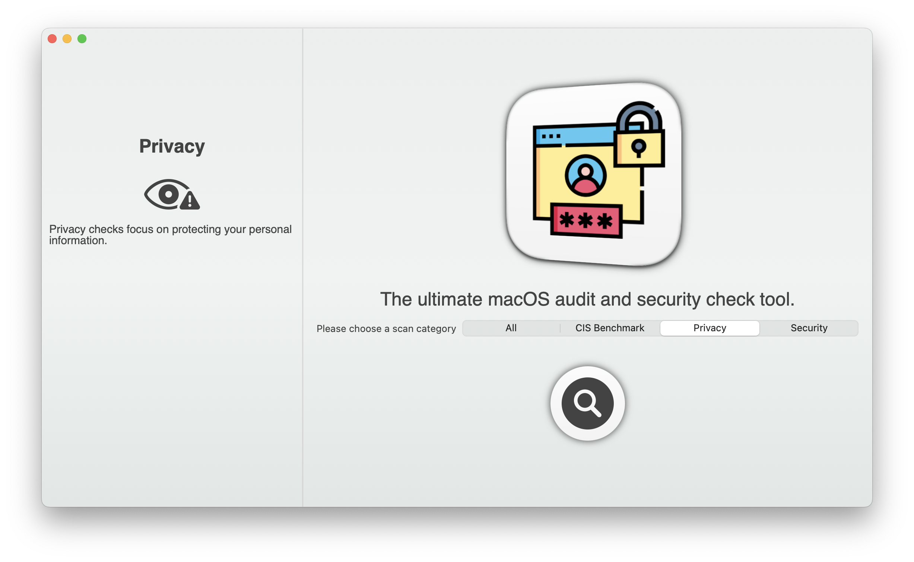
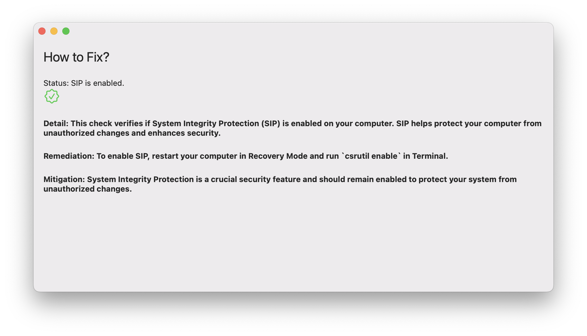

# Mergen - MacOS Audit and Security Check Tool

Mergen is an open-source, native macOS application for auditing and checking the security of your Mac. It scans your system for security issues based on the [Center for Internet Security (CIS) Benchmark](https://www.cisecurity.org/cis-benchmarks), and checks various settings and configurations related to security and privacy.





```bash
Mergen provides the following features to help you secure your Mac:

1. Check Gatekeeper Status
2. Check Secure Kernel Extension Loading
3. Guest Login Status Check
4. iCloud Drive Status Check
5. Check If SSH Is Enabled
6. Check Firewall Status
7. Check FileVault Status
8. Check All Apple-Provided Software Is Updated In Last 30 Days
9. Check Auto Update Is Enabled
10. Check 'Install Application Updates from the App Store' Is Enabled
11. Check Install Security Responses and System Files Is Enabled
12. Check 'Install system data files and security updates' Is Enabled
13. Check Firewall Stealth Mode Is Enabled
14. Check AirDrop Is Disabled
15. Check AirPlay Receiver Is Disabled
16. Check 'Set Time and Date Automatically' Is Enabled
17. Check Time Is Set Within Appropriate Limits
18. Check DVD or CD Sharing Is Disabled
19. Check Screen Sharing Is Disabled
20. Check File Sharing Is Disabled
21. Check Printer Sharing Is Disabled
22. Check Remote Login Is Disabled
23. Check Remote Management(ARDagent) Is Disabled
24. Check Remote Apple Events Is Disabled
25. Check Internet Sharing Is Disabled
26. Check Content Caching Is Disabled
27. Check Media Sharing Is Disabled
28. Check Bluetooth Sharing Is Disabled
29. Check Backup Automatically is Enabled If Time Machine Is Enabled
30. Check that Time Machine is Enabled
31. Check Time Machine Volumes Are Encrypted If Time Machine Is Enabled
32. Check Show Wi-Fi status in Menu Bar Is Enabled
33. Check Show Bluetooth Status in Menu Bar Is Enabled
34. Check Location Services Is Enabled
35. Check Location Services Is in the Menu Bar
36. Check Personalized Ads Status
37. Check Screen Saver Corners Are Secure
38. Check Universal Control is Disabled
39. Check Wake for Network Access is Disabled
40. Check an Inactivity Interval of 20 Minutes or Less for the Screen Saver Is Enabled
41. Check a Password is Required to Wake the Computer from Sleep or Screen Saver
42. Check Security Auditing Is Enabled
43. Check System Integrity Protection (SIP) Status
44. Check XProtect Status
45. Check Certificate Trust Settings
46. Check Siri Status
47. Check Sending Diagnostic and Usage Data to Apple Status
48. Check Java 6 Default Runtime Status
49. Check EFI Version is Valid and Regularly Checked
50. Check Bonjour Advertising Service Status
51. Check HTTP Server Status
52. Check NFS Server Status
53. Check 'Show Password Hints' Status
54. Check 'Allow guests to connect to shared folders' Status
55. Check Filename Extension Status
56. Check Automatic Run of Safe Files in Safari
57. Check Safari Disable Internet Plugins for Global Use
58. Check Fast User Switching Status
```
## Installation and Usage

Mergen is an open-source project, and you can download the latest release binary from the GitHub repository or you can build yourself.

```bash
git clone https://github.com/sametsazak/mergen.git
```

Open the Mergen.xcworkspace file in Xcode.

Build and run the project in Xcode.

### Usage

Once you have installed Mergen, you can launch the application and start checking the security issues. The application is user-friendly and easy to use. Follow the steps mentioned below to check the security issues:

- Launch the Mergen application.

- Choose a category and press the scan button to start the security check.



- Once the security check is complete, you can see the reporting options and statistics. 

- You can see more details by double clicking the findings.




## Reporting


### HTML Report

The HTML export feature lets you quickly generate a professional-looking report of your scan results. This report includes all the details about the security checks performed, as well as any warnings or errors that were detected. You can share it with others for review or reference.


### JSON Export

The JSON export feature allows you to export the scan results in JSON format that other applications can quickly process. This is particularly useful if you need to integrate the results with other security tools or workflows. The JSON format provides a detailed breakdown of each security check, making it easy to identify areas requiring further attention.

```json
 {
    "status" : "Firewall is enabled.",
    "documentation" : "For more information on configuring your firewall, visit: https:\/\/support.apple.com\/en-us\/HT201642",
    "category" : "CIS Benchmark",
    "mitigation" : "Enabling and configuring the firewall helps prevent unauthorized access to your device and increases overall security. A properly configured firewall can block incoming connections and minimize the risk of unauthorized access.",
    "remediation" : "To enable and configure the firewall, go to System Preferences -> Security & Privacy -> Firewall, click 'Turn On Firewall', and 'Firewall Options...' to block incoming connections.",
    "description" : "The firewall helps protect your device from unauthorized access. This check verifies if the firewall is enabled and configured correctly.",
    "severity" : "High",
    "name" : "Check Firewall Status",
    "docID" : 5
  }
  ```

## Challenges

Developing this application was a fun but challenging experience. Here's a rundown of the main problems I faced along the way:

1. Learning Swift and SwiftUI on the Fly

As a Python-savvy developer, I had to learn Swift and SwiftUI on the go while building Mergen. I had to learn Swift and SwiftUI while simultaneously developing Mergen. This learning curve was a unique challenge, as I had to familiarize myself with new programming languages. However, through dedication and perseverance, I managed to overcome some problems and, at least, created a simple version my ideas.

2. No Admin Rights? No Problem!

Mergen's all about security, so it needed access to system settings and configs. But getting admin rights or using sudo in a macOS app wasn't an option, which made some security checks a bit tricky. To work around this, I focused on checks that could run with just user rights, even if it meant sacrificing a few features.

3. Keeping the Code Simple and User-Friendly

In an effort to make Mergen as accessible as possible for users and contributors. This goal presented a challenge, as macOS has numerous versions, and not every module could be tested on each one. As a result, user feedback is vital for identifying and addressing any compatibility issues or limitations that may arise due to the differences in macOS versions. This feedback-driven approach allows Mergen to continuously improve and adapt to different environments.


## Contributing

Since I'm not an expert Swift developer, there might be some issues with the code but we welcome contributions from anyone interested in improving the security of Mac. If you are interested in contributing to the project, please follow these steps:

- Fork the repository and clone it to your local machine.

- Create a new branch for your changes.

- Make your changes and write tests it.

- Commit your changes and push them to your forked repository.

- Open a pull request and describe your changes in detail.

## License
Mergen is released under the MIT License.

```bash
MIT License

Copyright (c) [2023] [Samet Sazak]

Permission is hereby granted, free of charge, to any person obtaining a copy
of this software and associated documentation files (the "Software"), to deal
in the Software without restriction, including without limitation the rights
to use, copy, modify, merge, publish, distribute, sublicense, and/or sell
copies of the Software, and to permit persons to whom the Software is
furnished to do so, subject to the following conditions:

The above copyright notice and this permission notice shall be included in all
copies or substantial portions of the Software.

THE SOFTWARE IS PROVIDED "AS IS", WITHOUT WARRANTY OF ANY KIND, EXPRESS OR
IMPLIED, INCLUDING BUT NOT LIMITED TO THE WARRANTIES OF MERCHANTABILITY,
FITNESS FOR A PARTICULAR PURPOSE AND NONINFRINGEMENT. IN NO EVENT SHALL THE
AUTHORS OR COPYRIGHT HOLDERS BE LIABLE FOR ANY CLAIM, DAMAGES OR OTHER
LIABILITY, WHETHER IN AN ACTION OF CONTRACT, TORT OR OTHERWISE, ARISING FROM,
OUT OF OR IN CONNECTION WITH THE SOFTWARE OR THE USE OR OTHER DEALINGS IN THE
SOFTWARE.
```
