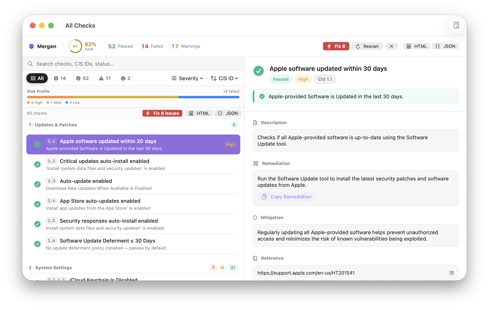
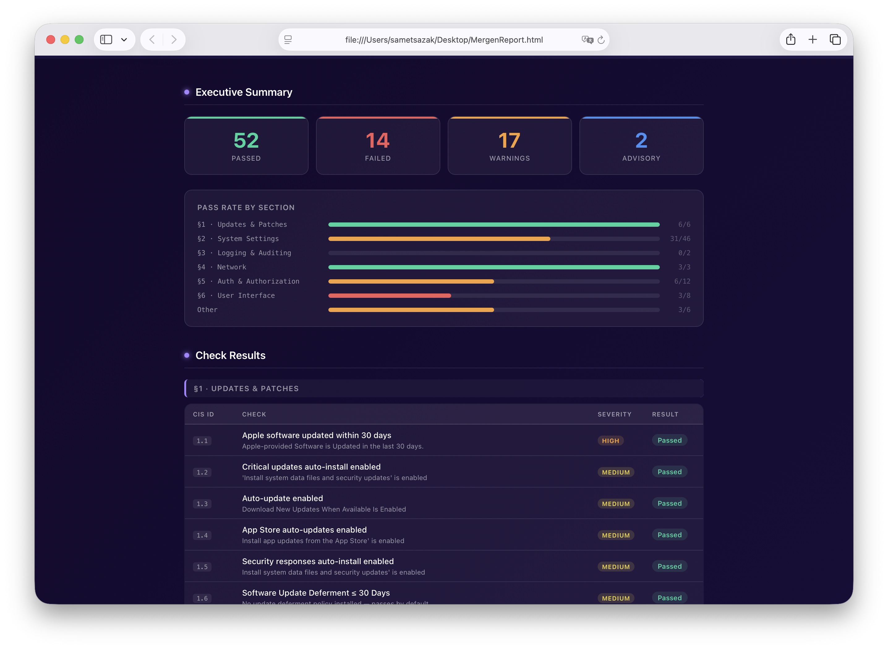
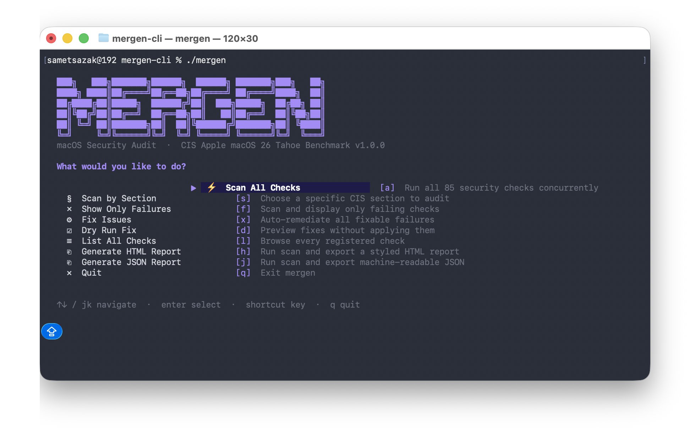

<div align="center">

# 🛡️ Mergen v3

**Native macOS security audit — CIS Apple macOS 26 Tahoe Benchmark v1.0.0**

[](https://github.com/sametsazak/mergen)
[](https://swift.org)
[](https://go.dev)
[](LICENSE)
[](https://github.com/sametsazak/mergen/releases)
[](https://www.cisecurity.org)
[](https://github.com/sametsazak/homebrew-mergen)

Mergen audits your Mac against 85 CIS Benchmark controls, **fixes most failures automatically**, and scans your installed packages for supply chain threats.
Available as a native **SwiftUI app** and a **Go CLI** — pick whichever fits your workflow.





</div>

---

## Table of Contents

- [Overview](#overview)
- [What's New in v3](#whats-new-in-v3)
- [SwiftUI App](#swiftui-app)
- [CLI (`mergen-cli`)](#cli-mergen-cli)
- [Supply Chain Threat Surface](#supply-chain-threat-surface)
- [Checks Reference](#checks-reference)
- [How Auto-Fix Works](#how-auto-fix-works)
- [macOS 26 Tahoe Compatibility](#macos-26-tahoe-compatibility)
- [Contributing](#contributing)
- [License](#license)

---

## Overview

Mergen audits macOS security configuration against the **CIS Apple macOS 26 Tahoe Benchmark v1.0.0** and scans your installed software supply chain for threats.

Unlike shell scripts that only report findings, Mergen can **remediate failures directly** — applying the correct system change and immediately re-verifying the result.

> All feedback, issues, and pull requests are welcome.

---

## What's New in v3

**Supply Chain Threat Surface module** — a dedicated scanner that goes beyond CVE databases and checks for active threats in your installed packages and system persistence mechanisms:

- Persistent Launch Agent / Daemon analysis (writable paths, missing binaries, recently added)
- Cron job detection
- LLM model file scanning (pickle/PyTorch files that execute arbitrary code on load)
- Homebrew unofficial tap review
- npm postinstall script analysis for suspicious patterns
- Typosquatting detection against 100+ popular PyPI and npm packages
- Python `.pth` file analysis (files that execute code on every Python startup)
- CVE scanning via the OSV database (PyPI + npm, no API key required)
- **Confirmed malicious package detection** via the OSSF malicious-packages feed — flags packages confirmed as malware, not just vulnerable ones
- pip-audit integration when installed
- Per-finding auto-fix (upgrade, uninstall, or remove persistence)
- Fix All sheet for supply chain findings — batches all admin fixes into one password prompt

---

## SwiftUI App

The GUI option — point and click, no Terminal needed.

### Features

**CIS Benchmark Scanning**
- 85 automated checks across CIS sections 1–6
- Live results — list populates as checks complete
- 15-second per-check timeout so hung checks never stall the scan
- Apple Intelligence / AI privacy checks (CIS 2.5.x, new in Tahoe)

**Supply Chain Threat Surface**
- Layered scanning: local analysis → OSV vulnerability database → pip-audit
- Two-pane layout: findings list with severity and source badges, detail panel with full advisory text, CVE IDs, published date, fixed version, and reference links
- Source badges distinguish Local analysis, OSV advisories, OSSF-confirmed malware, and pip-audit findings
- Auto-fix per finding or Fix All in one sheet

**Auto-Remediation**
- Fix individual checks from the detail panel
- **Fix All sheet** — see every fixable failure, apply them all at once
- Two privilege tiers: user-level runs silently; admin uses one password prompt
- After every fix the check re-runs to verify the result

**Audit Logging**
- Every scan and fix is logged to `~/Library/Logs/mergen/mergen-YYYY-MM-DD.log`
- In-app log viewer: color-coded entries, filter by type, search, copy-all

**Reporting**
- HTML report: styled, standalone, shareable
- JSON export: full metadata per check including CIS ID, status, severity, and remediation

**Interface**
- 2-pane layout: Results list → Detail panel
- Filter pills: All / Failed / Passed / Warnings / Advisory
- Sort by CIS ID, Severity, Name, or Status
- Search across name, CIS ID, description, and finding text
- Security score ring with percentage, GOOD / FAIR / AT RISK label, and pass/fail/warn counts

### Installation

**Via Homebrew (recommended):**
```bash
brew install --cask sametsazak/mergen/mergen-app
```

**Or download the DMG** from the [latest release](https://github.com/sametsazak/mergen/releases/latest).

**Build from source:**
```bash
git clone https://github.com/sametsazak/mergen.git
```
Open `mergen.xcodeproj` in Xcode and run. No third-party dependencies.

**Requirements:** macOS 13 Ventura or later · Tested on macOS 26 Tahoe

### Usage

1. Launch Mergen and press **Scan**
2. Use the **Failed** filter pill and sort by Severity to prioritize
3. Click any check to see description, finding, and remediation steps
4. Press **Fix N** in the top bar to open the Fix All sheet
5. Export results as **HTML** or **JSON**
6. Open the **Threat Surface** tab to scan your installed packages

### Admin Privilege Notice

Some fixes require elevated privileges. When an admin fix runs:
- macOS shows the **standard system authentication dialog**
- Your password is handled entirely by macOS via `do shell script ... with administrator privileges`
- **Mergen never stores, logs, or transmits your password**
- Every fix command is visible in [`FixCommands.swift`](mergen/core/FixCommands.swift)

When using **Fix All**, all admin fixes are batched into a **single password prompt**.

---

## CLI (`mergen-cli`)

A fully-featured Go CLI covering the same 85 CIS checks, built for power users, sysadmins, and CI pipelines.

```
  ███╗   ███╗███████╗██████╗  ██████╗ ███████╗███╗   ██╗
  ████╗ ████║██╔════╝██╔══██╗██╔════╝ ██╔════╝████╗  ██║
  ██╔████╔██║█████╗  ██████╔╝██║  ███╗█████╗  ██╔██╗ ██║
  ██║╚██╔╝██║██╔══╝  ██╔══██╗██║   ██║██╔══╝  ██║╚██╗██║
  ██║ ╚═╝ ██║███████╗██║  ██║╚██████╔╝███████╗██║ ╚████║
  ╚═╝     ╚═╝╚══════╝╚═╝  ╚═╝ ╚═════╝ ╚══════╝╚═╝  ╚═══╝
  macOS Security Audit CLI  ·  CIS Apple macOS 26 Tahoe Benchmark v1.0.0
```



### Installation

**Via Homebrew (recommended):**
```bash
brew install sametsazak/mergen/mergen
```

**Build from source:**
```bash
git clone https://github.com/sametsazak/mergen.git
cd mergen/mergen-cli
go build -o mergen .
sudo mv mergen /usr/local/bin/   # optional: install system-wide
```

**Requirements:** Go 1.21+, macOS 13+

### Commands

#### `mergen` — Interactive TUI

Running `mergen` with no arguments launches a keyboard-driven interactive menu:

```
  What would you like to do?

 ▶ ⚡  Scan All Checks          [a]  Run all 85 security checks concurrently
   §   Scan by Section          [s]  Choose a specific CIS section to audit
   ✗   Show Only Failures       [f]  Scan and display only failing checks
   ⚙   Fix Issues               [x]  Auto-remediate all fixable failures
   ☑   Dry Run Fix              [d]  Preview fixes without applying them
   ≡   List All Checks          [l]  Browse every registered check
   ⎘   Generate HTML Report     [h]  Run scan and export a styled HTML report
   ⎘   Generate JSON Report     [j]  Run scan and export machine-readable JSON
   ✕   Quit                     [q]  Exit mergen

  ↑↓ / jk navigate  ·  enter select  ·  shortcut key  ·  q quit
```

#### `mergen scan` — Run Security Checks

```bash
mergen scan [flags]
```

**Flags:**

| Flag | Short | Default | Description |
|------|-------|---------|-------------|
| `--section` | `-s` | — | Run only checks in a CIS section (1–6) |
| `--category` | `-c` | — | Filter by category (e.g. `CIS Benchmark`) |
| `--failed` | `-f` | false | Show only failed checks |
| `--quiet` | `-q` | false | Print summary only |
| `--json` | — | false | Output results as JSON array |
| `--workers` | `-w` | 8 | Number of parallel check workers |

**Exit codes:** `0` = all checks pass · `1` = one or more failures

#### `mergen fix` — Auto-Remediate Failures

```bash
mergen fix [flags]
```

| Flag | Short | Default | Description |
|------|-------|---------|-------------|
| `--id` | — | — | Fix a single check by CIS ID (e.g. `2.2.1`) |
| `--yes` | `-y` | false | Apply all fixes without confirmation |
| `--dry-run` | — | false | Preview fixes without applying |

#### `mergen list` — Browse All Checks

```bash
mergen list [--section 1-6]
```

#### `mergen report` — Export HTML or JSON

```bash
mergen report                             # HTML → ./mergen-report.html
mergen report --format json               # JSON → ./mergen-report.json
mergen report --format html -o ~/Desktop/audit.html
```

### Examples

```bash
# Full scan
mergen scan

# Show only failures
mergen scan --failed

# Machine-readable output
mergen scan --json | jq '.[] | select(.status == "fail")'

# Fix everything that can be fixed
mergen fix --yes

# Preview what would be fixed
mergen fix --dry-run

# Export HTML report
mergen report --format html -o ~/Desktop/security-audit.html
```

### CI / CD Integration

```yaml
# GitHub Actions example
- name: Run security audit
  run: |
    cd mergen-cli
    go build -o mergen .
    ./mergen scan --quiet --json > audit.json
  continue-on-error: true

- name: Upload audit report
  uses: actions/upload-artifact@v3
  with:
    name: security-audit
    path: audit.json
```

```bash
# Fail CI if any checks fail
mergen scan --json | jq -e '[.[] | select(.status == "fail")] | length == 0' || exit 1
```

---

## Supply Chain Threat Surface

The Threat Surface tab scans your installed packages and system for supply chain risks that traditional vulnerability scanners miss.

### How It Works

Scanning runs in three layers:

**Layer 1 — Local analysis (no network)**

| Check | What it looks for |
|-------|-------------------|
| Launch Agents & Daemons | Entries pointing to writable/temp paths, missing binaries, or added in the last 14 days |
| Cron jobs | Any user crontab entries (uncommon on macOS, worth reviewing) |
| LLM model files | Pickle / PyTorch files (execute arbitrary code on load), model files outside known app directories with no quarantine flag |
| Homebrew taps | Unofficial taps (unvetted Ruby scripts that run as root during install) |
| npm postinstall scripts | `preinstall` / `install` / `postinstall` hooks containing `curl`, `wget`, `base64`, `eval`, or shell calls |
| Typosquatting | Installed packages within one character of 100+ popular PyPI and npm packages |
| Python `.pth` files | Files in site-packages containing `import` statements — execute code on every Python startup |

**Layer 2 — OSV database (PyPI + npm)**

Queries the [OSV.dev](https://osv.dev) API for every installed package. No API key required. Returns two types of findings:

- **CVE advisories** — known vulnerabilities with fix version and references
- **Confirmed malicious packages** — entries from the [OSSF malicious-packages](https://github.com/ossf/malicious-packages) feed, identified by `MAL-` prefixed IDs. These are packages confirmed as intentional malware (infostealers, backdoors, typosquats), shown as Critical severity with an OSSF badge.

**Layer 3 — pip-audit (if installed)**

Runs `pip-audit` for a second opinion on Python packages. Findings that overlap with Layer 2 are deduplicated automatically.

### Optional Tools

Install these to extend coverage:

```bash
pip3 install pip-audit
```

pip-audit is not required — Layers 1 and 2 run without it.

### Auto-Fix

Most supply chain findings have a one-click fix:

| Finding type | Fix action |
|---|---|
| CVE in pip package | `pip3 install --upgrade <package>` |
| CVE in npm package | `npm update -g <package>` |
| Confirmed malicious package | `pip3 uninstall -y <package>` / `npm uninstall -g <package>` |
| Unofficial Homebrew tap | `brew untap <tap>` |
| Suspicious npm postinstall | `npm uninstall -g <package>` |
| Possible typosquat | `pip3 uninstall -y <package>` / `npm uninstall -g <package>` |
| Launch Agent (writable path) | `launchctl unload && rm` |
| Launch Agent (missing binary) | `rm <plist>` |

**Fix All** batches all admin-level fixes into a single password prompt.

---

## Checks Reference

### §1 — Software Updates

| CIS ID | Check | Severity | Auto-Fix |
|--------|-------|----------|----------|
| 1.1 | Apple software updated within 30 days | High | — |
| 1.2 | Critical updates auto-install enabled | Medium | ✓ Admin |
| 1.3 | Auto-update enabled | High | ✓ Admin |
| 1.4 | App Store auto-updates enabled | Medium | ✓ Admin |
| 1.5 | Security responses auto-install enabled | High | ✓ Admin |
| 1.6 | Software update deferment policy | Low | — |

### §2 — System Settings

| CIS ID | Check | Severity | Auto-Fix |
|--------|-------|----------|----------|
| 2.1.1.1 | iCloud Keychain (advisory) | Low | — |
| 2.1.1.3 | iCloud Drive Desktop/Documents sync disabled | Medium | — |
| 2.2.1 | Firewall enabled | Critical | ✓ Admin |
| 2.2.2 | Firewall stealth mode enabled | High | ✓ Admin |
| 2.3.1.1 | AirDrop disabled | Medium | ✓ User |
| 2.3.1.2 | AirPlay Receiver disabled | Low | ✓ User |
| 2.3.2.1 | Time set automatically | Medium | ✓ Admin |
| 2.3.2.2 | Time within appropriate limits | Low | — |
| 2.3.3.1 | Screen sharing disabled | High | ✓ Admin |
| 2.3.3.2 | File sharing disabled | High | ✓ Admin |
| 2.3.3.3 | Printer sharing disabled | Low | ✓ Admin |
| 2.3.3.4 | Remote login (SSH) disabled | Critical | ✓ Admin |
| 2.3.3.5 | Remote management disabled | High | ✓ Admin |
| 2.3.3.6 | Remote Apple Events disabled | Medium | ✓ Admin |
| 2.3.3.7 | Internet sharing disabled | High | ✓ Admin |
| 2.3.3.8 | Content caching disabled | Low | ✓ Admin |
| 2.3.3.9 | Media sharing disabled | Low | ✓ Admin |
| 2.3.3.10 | Bluetooth sharing disabled | Low | ✓ User |
| 2.5.1.1 | External Intelligence Extensions disabled | Medium | — |
| 2.5.1.2 | Apple Intelligence Writing Tools disabled | Medium | — |
| 2.5.1.3 | Apple Intelligence Mail Summarization disabled | Low | — |
| 2.5.1.4 | Apple Intelligence Notes Summarization disabled | Low | — |
| 2.5.2.1 | Siri disabled | Low | ✓ User |
| 2.6.1.1 | Location services enabled | Low | — |
| 2.6.1.2 | Location services shown in menu bar | Low | — |
| 2.6.3.1 | Diagnostic data sharing disabled | Low | ✓ Admin |
| 2.6.3.2 | Improve Siri & Dictation disabled | Low | ✓ User |
| 2.6.3.3 | Improve assistive voice features disabled | Low | ✓ User |
| 2.6.3.4 | Share with app developers disabled | Low | — |
| 2.6.4 | Personalized ads disabled | Low | ✓ User |
| 2.6.5 | Gatekeeper enabled | High | ✓ Admin |
| 2.6.7 | Lockdown Mode status (advisory) | Low | — |
| 2.6.8 | Admin password required for System Settings | Medium | — |
| 2.7.1 | Screen saver hot corners configured | Low | — |
| 2.8.1 | Universal Control disabled | Low | ✓ User |
| 2.9.1 | Spotlight search query sharing disabled | Low | ✓ User |
| 2.10.1.2 | Sleep enabled (Apple Silicon) | Medium | ✓ Admin |
| 2.10.2 | Power Nap disabled | Low | ✓ Admin |
| 2.10.3 | Wake for network access disabled | Low | ✓ Admin |
| 2.11.1 | Screen saver activates within 20 minutes | Medium | ✓ User |
| 2.11.2 | Password required on wake | High | ✓ User |
| 2.11.3 | Login window message configured | Low | — |
| 2.11.4 | Login window shows name and password fields | Medium | ✓ Admin |
| 2.11.5 | Password hints disabled | Medium | ✓ Admin |
| 2.13.1 | Guest login disabled | High | ✓ Admin |
| 2.13.2 | Guest access to shared folders disabled | High | ✓ Admin |
| 2.13.3 | Automatic login disabled | Critical | ✓ Admin |

### §3 — Logging & Auditing

| CIS ID | Check | Severity | Auto-Fix |
|--------|-------|----------|----------|
| 3.1 | Security auditing enabled | Medium | — |
| 3.3 | Audit flags configured | Medium | — |

### §4 — Network

| CIS ID | Check | Severity | Auto-Fix |
|--------|-------|----------|----------|
| 4.1 | Bonjour advertising disabled | Low | ✓ Admin |
| 4.2 | Apache HTTP server disabled | High | ✓ Admin |
| 4.3 | NFS server disabled | High | ✓ Admin |

### §5 — Authentication & Authorization

| CIS ID | Check | Severity | Auto-Fix |
|--------|-------|----------|----------|
| 5.1.1 | System Integrity Protection (SIP) enabled | Critical | — |
| 5.1.3 | AMFI (Apple Mobile File Integrity) enabled | High | — |
| 5.1.4 | Signed System Volume (SSV) enabled | High | — |
| 5.2.1 | Password lockout threshold ≤ 5 attempts | High | ✓ Admin |
| 5.2.2 | Minimum password length ≥ 15 characters | High | ✓ Admin |
| 5.4 | Sudo timeout configured | Medium | ✓ Admin |
| 5.5 | Sudo TTY tickets enabled | Medium | ✓ Admin |
| 5.6 | Root account disabled | High | ✓ Admin |
| 5.9 | Guest home folder does not exist | Low | — |
| 5.10 | XProtect protection enabled | High | — |
| 5.11 | Sudo logging enabled | Medium | ✓ Admin |
| — | FileVault full-disk encryption enabled | Critical | — |
| — | Certificate trust settings valid | High | — |

### §6 — User Interface

| CIS ID | Check | Severity | Auto-Fix |
|--------|-------|----------|----------|
| 6.1.1 | Filename extensions shown in Finder | Low | ✓ User |
| 6.1.2 | Home folder permissions restrictive | Medium | — |
| 6.3.1 | Safari auto-open safe files disabled | Medium | ✓ User |
| 6.3.3 | Safari fraudulent website warning enabled | Medium | ✓ User |
| 6.3.4 | Safari cross-site tracking prevention enabled | Medium | ✓ User |
| 6.3.6 | Safari advertising privacy (Private Click Measurement) | Low | ✓ User |
| 6.3.8 | Safari internet plugins disabled | Medium | ✓ User |
| 6.3.10 | Safari status bar shown | Low | ✓ User |
| 6.4.1 | Terminal secure keyboard entry enabled | Medium | ✓ User |

### Additional Checks

| Check | Severity | Auto-Fix |
|-------|----------|----------|
| Bluetooth status shown in menu bar | Low | — |
| Fast user switching disabled | Medium | ✓ Admin |
| Time Machine volumes encrypted | High | — |
| EFI firmware version valid (Intel only) | High | — |
| Java 6 runtime disabled | High | — |

---

## How Auto-Fix Works

Mergen applies fixes at two privilege levels:

| Level | How it runs | Typical checks |
|-------|-------------|----------------|
| **User** | Runs as you, no password needed | Safari, screen saver, AirDrop, Siri, privacy settings |
| **Admin** | Standard macOS auth dialog (AppleScript) | Firewall, sharing services, software update policy, login settings |

After every fix attempt the original check re-runs. The result — Fixed or Still failing — reflects the actual check outcome, not just whether the command exited cleanly.

In both the app and CLI, all admin fixes within a single session are batched into **one password prompt**.

---

## macOS 26 Tahoe Compatibility

| Change in Tahoe | How Mergen handles it |
|-----------------|----------------------|
| `com.apple.alf` plist removed | Firewall checks use `socketfilterfw --getglobalstate` |
| `com.apple.auditd` removed | Section 3 checks report Yellow/Warn, not Red/Fail |
| Screen saver keys moved to `-currentHost` domain | Checks try `-currentHost` first, fall back to user domain |
| `spctl --status` writes to stderr | Both stdout and stderr captured |
| New Apple Intelligence privacy controls | CIS 2.5.1.x checks use MDM profile queries |

---

## Contributing

Issues, pull requests, and new checks are all welcome.

**To add a check to the SwiftUI app:** subclass `Vulnerability` in `mergen/checkmodules/`, register it in `Scanner.swift`, and optionally add a fix command to `FixCommands.swift`.

**To add a check to the CLI:** create a new file in `mergen-cli/internal/checks/`, implement an `init()` function that calls `Register(newCheck(...))`. The check auto-registers via Go's `init()` mechanism.

**Fix command rule:** The fix must write to the exact same key/plist/API that the check reads. Otherwise the re-check will always report failure even if the command succeeded.

---

## License

MIT License — Copyright (c) 2023–2026 Samet Sazak

Permission is hereby granted, free of charge, to any person obtaining a copy of this software and associated documentation files (the "Software"), to deal in the Software without restriction, including without limitation the rights to use, copy, modify, merge, publish, distribute, sublicense, and/or sell copies of the Software, and to permit persons to whom the Software is furnished to do so, subject to the following conditions:

The above copyright notice and this permission notice shall be included in all copies or substantial portions of the Software.

THE SOFTWARE IS PROVIDED "AS IS", WITHOUT WARRANTY OF ANY KIND, EXPRESS OR IMPLIED, INCLUDING BUT NOT LIMITED TO THE WARRANTIES OF MERCHANTABILITY, FITNESS FOR A PARTICULAR PURPOSE AND NONINFRINGEMENT. IN NO EVENT SHALL THE AUTHORS OR COPYRIGHT HOLDERS BE LIABLE FOR ANY CLAIM, DAMAGES OR OTHER LIABILITY, WHETHER IN AN ACTION OF CONTRACT, TORT OR OTHERWISE, ARISING FROM, OUT OF OR IN CONNECTION WITH THE SOFTWARE OR THE USE OR OTHER DEALINGS IN THE SOFTWARE.
