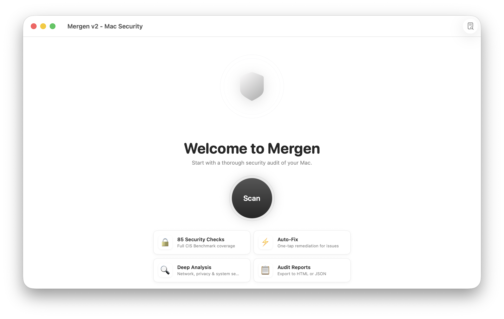

<div align="center">

# 🛡️ Mergen

**Native macOS security audit tool — CIS Apple macOS 26 Tahoe Benchmark v1.0.0**

[](https://github.com/sametsazak/mergen)
[](https://swift.org)
[](LICENSE)
[](https://github.com/sametsazak/mergen/releases)
[](https://www.cisecurity.org)

Mergen audits your Mac against 90+ CIS Benchmark controls and **fixes most failures automatically** — no terminal required.



</div>

---

## Overview

Mergen is a free, open-source, fully native SwiftUI app that audits macOS security configuration against the **CIS Apple macOS 26 Tahoe Benchmark v1.0.0**. It covers software updates, firewall, sharing services, privacy, authentication, and more.

Unlike shell scripts or compliance tools that only report findings, Mergen can **remediate failures directly** — applying the correct system change and immediately re-verifying the result.

> All feedback, issues, and pull requests are welcome. The code is open — if you find a bug or want to add a check, open an issue or PR.

---

## ⚠️ Administrator Privilege Notice

Some fixes require elevated privileges. When an admin-level fix runs:

- macOS shows the **standard system authentication dialog** — the same one used by System Settings
- Your password is handled entirely by macOS via `do shell script ... with administrator privileges`
- **Mergen never stores, logs, or transmits your password**
- The exact command run is written to the audit log before execution — fully inspectable
- Every fix command is visible in [`FixCommands.swift`](mergen/core/FixCommands.swift)

When using **Fix All**, all admin fixes are batched into a **single password prompt**.

---

## Features

### Scanning
- 90+ automated checks across CIS sections 1–6
- Live results — list populates as checks complete
- 15-second per-check timeout so hung checks never stall the scan
- Apple Intelligence / AI privacy checks (CIS 2.5.x, new in Tahoe)

### Auto-Remediation
- **Fix individual checks** from the detail panel
- **Fix All sheet** — see every fixable failure, apply them all at once
- **Two privilege tiers**: user-level fixes run silently; admin fixes use one password prompt
- **Before/after preview** — each fix shows what's currently wrong and what will change
- After every fix, the check re-runs to verify the result
- When a fix doesn't resolve the issue, the actual check finding is shown so you know why

### Audit Logging
- Every scan and fix action is logged to `~/Library/Logs/mergen/mergen-YYYY-MM-DD.log`
- In-app log viewer: color-coded entries, filter by type, search, copy-all
- Accessible from the toolbar, the Fix All sheet, and individual check detail panels

### Reporting
- **HTML report**: styled, standalone, sharable
- **JSON export**: full metadata per check including CIS ID, status, severity, and remediation

### Interface
- 3-pane layout: Sidebar → Results list → Detail panel
- Filter pills: All / Failed / Passed / Warnings / Advisory
- Sort by CIS ID, Severity, Name, or Status
- Search across name, CIS ID, description, and finding text
- Security score ring with animated breakdown
- Dark mode support

---

## Checks

### Section 1 — Software Updates
| CIS ID | Check | Auto-Fix |
|--------|-------|----------|
| 1.2 | Critical updates auto-install enabled | ✓ Admin |
| 1.3 | Auto-update enabled | ✓ Admin |
| 1.4 | App Store auto-updates enabled | ✓ Admin |
| 1.5 | Security responses auto-install enabled | ✓ Admin |
| 1.6 | Software update deferment policy | — |

### Section 2 — System Settings
| CIS ID | Check | Auto-Fix |
|--------|-------|----------|
| 2.1.1.1 | iCloud Keychain (advisory) | — |
| 2.1.1.3 | iCloud Drive disabled | — |
| 2.2.1 | Firewall enabled | ✓ Admin |
| 2.2.2 | Firewall stealth mode enabled | ✓ Admin |
| 2.3.1.1 | AirDrop disabled | ✓ User |
| 2.3.1.2 | AirPlay Receiver disabled | ✓ User |
| 2.3.2.1 | Time set automatically | ✓ Admin |
| 2.3.2.2 | Time within appropriate limits | — |
| 2.3.3.1 | Screen sharing disabled | ✓ Admin |
| 2.3.3.2 | File sharing disabled | ✓ Admin |
| 2.3.3.3 | Printer sharing disabled | ✓ Admin |
| 2.3.3.4 | Remote login (SSH) disabled | ✓ Admin |
| 2.3.3.5 | Remote management disabled | ✓ Admin |
| 2.3.3.6 | Remote Apple Events disabled | ✓ Admin |
| 2.3.3.7 | Internet sharing disabled | ✓ Admin |
| 2.3.3.8 | Content caching disabled | ✓ Admin |
| 2.3.3.9 | Media sharing disabled | ✓ Admin |
| 2.3.3.10 | Bluetooth sharing disabled | ✓ User |
| 2.5.1.1 | External Intelligence Extensions disabled | — |
| 2.5.1.2 | Writing Tools (Apple Intelligence) disabled | — |
| 2.5.1.3 | Mail summarization disabled | — |
| 2.5.1.4 | Notes summarization disabled | — |
| 2.5.2.1 | Siri disabled | ✓ User |
| 2.6.3.1 | Diagnostic data sharing disabled | ✓ Admin |
| 2.6.3.2 | Improve Siri & Dictation disabled | ✓ User |
| 2.6.3.3 | Improve assistive voice disabled | ✓ User |
| 2.6.3.4 | Share with app developers disabled | — |
| 2.6.4 | Personalized ads disabled | ✓ User |
| 2.6.5 | Gatekeeper enabled | ✓ Admin |
| 2.6.7 | Lockdown Mode (advisory) | — |
| 2.6.8 | Admin password required for System Settings | — |
| 2.8.1 | Universal control disabled | ✓ User |
| 2.9.1 | Improve Spotlight suggestions disabled | — |
| 2.10.1.2 | Sleep enabled (Apple Silicon) | ✓ Admin |
| 2.10.2 | Power Nap disabled | ✓ Admin |
| 2.10.3 | Wake for network access disabled | ✓ Admin |
| 2.11.1 | Screen saver activates within 20 minutes | ✓ User |
| 2.11.2 | Password required on wake | ✓ User |
| 2.11.3 | Login window message configured | — |
| 2.11.4 | Login window shows name and password fields | ✓ Admin |
| 2.11.5 | Password hints disabled | ✓ Admin |
| 2.13.1 | Guest login disabled | ✓ Admin |
| 2.13.2 | Guest access to shared folders disabled | ✓ Admin |
| 2.13.3 | Automatic login disabled | ✓ Admin |

### Section 3 — Logging & Auditing
| CIS ID | Check | Auto-Fix |
|--------|-------|----------|
| 3.2 | Security auditing enabled | — |
| 3.3 | Audit flags configured | — |

### Section 4 — Network
| CIS ID | Check | Auto-Fix |
|--------|-------|----------|
| 4.1 | Bonjour advertising disabled | ✓ Admin |
| 4.2 | Apache HTTP server disabled | ✓ Admin |
| 4.3 | NFS server disabled | ✓ Admin |

### Section 5 — Authentication & Authorization
| CIS ID | Check | Auto-Fix |
|--------|-------|----------|
| 5.1.1 | System Integrity Protection enabled | — |
| 5.1.3 | AMFI enabled | — |
| 5.1.4 | Signed System Volume (SSV) enabled | — |
| 5.2.1 | Password lockout threshold configured | ✓ Admin |
| 5.2.2 | Minimum password length enforced | ✓ Admin |
| 5.4 | Sudo timeout configured | ✓ Admin |
| 5.5 | Sudo TTY tickets enabled | ✓ Admin |
| 5.6 | Root account disabled | ✓ Admin |
| 5.9 | Sudo logging enabled | ✓ Admin |
| 5.10 | XProtect protection enabled | — |
| 5.11 | Secure kernel extension loading enforced | — |
| — | FileVault enabled | — |
| — | Certificate trust settings valid | — |

### Section 6 — User Interface
| CIS ID | Check | Auto-Fix |
|--------|-------|----------|
| 6.1.1 | Filename extensions shown | ✓ User |
| 6.1.2 | Home folder permissions | — |
| 6.3.1 | Safari auto-open safe files disabled | ✓ User |
| 6.3.3 | Safari fraudulent website warning enabled | ✓ User |
| 6.3.4 | Safari cross-site tracking prevention | ✓ User |
| 6.3.6 | Safari advertising privacy (Private Click Measurement) | ✓ User |
| 6.3.10 | Safari status bar shown | ✓ User |
| 6.4.1 | Terminal secure keyboard entry enabled | ✓ User |

### Additional Checks
| Check | Auto-Fix |
|-------|----------|
| Wi-Fi status shown in menu bar | — |
| Bluetooth status shown in menu bar | — |
| Location services shown in menu bar | — |
| Screen saver corners configured | — |
| Fast user switching disabled | ✓ Admin |
| Time Machine enabled | — |
| Time Machine backup enabled | — |
| Time Machine volumes encrypted | — |
| EFI version valid (Intel only) | — |
| App sandbox enforced | — |
| DVD/CD sharing disabled | — |
| Java 6 runtime disabled | — |
| Apple software updated within 30 days | — |

---

## How Auto-Fix Works

Mergen applies fixes at two privilege levels:

| Level | How it runs | Typical checks |
|-------|-------------|----------------|
| **User** | Runs as you, no password | Safari, screen saver, AirDrop, Siri, privacy settings |
| **Admin** | Standard macOS auth dialog via AppleScript | Firewall, sharing services, software update policy, login settings |

After every fix attempt the original check re-runs. The result shown — Fixed or Still failing — reflects the actual check outcome, not just whether the command exited cleanly.

---

## Audit Log

All scan and fix activity is logged automatically to:

```
~/Library/Logs/mergen/mergen-YYYY-MM-DD.log
```

Open it from the toolbar, from the Fix All sheet when failures remain, or from a check's detail panel after a failed fix.

---

## Installation

```bash
git clone https://github.com/sametsazak/mergen.git
```

Open `mergen.xcodeproj` in Xcode and run. No third-party dependencies. No network calls. Everything runs locally.

**Requirements:** macOS 13 Ventura or later (tested on macOS 26 Tahoe)

---

## Usage

1. Launch Mergen and press **Start Scan**
2. Use the **Failed** filter pill and sort by Severity to prioritize
3. Click any check to see description, finding, and remediation steps
4. Press **Fix N Issues** to open the Fix All sheet, or use the Fix button in each check's detail panel
5. Export results as **HTML** or **JSON** from the toolbar

---

## Contributing

Issues, pull requests, and new checks are all welcome.

**To add a new check:** subclass `Vulnerability` in `mergen/checkmodules/`, register it in `Scanner.swift`, and optionally add a fix command to `FixCommands.swift`.

**To add or fix a fix command:** add one line to the appropriate dictionary in `FixCommands.swift`. The fix must write to the exact same key, plist, or API that the check reads — otherwise the re-check will always report failure even if the command succeeded.

---

## macOS 26 Tahoe Compatibility

| Change in Tahoe | How Mergen handles it |
|-----------------|----------------------|
| `com.apple.alf` plist removed | Firewall checks use `socketfilterfw --getglobalstate` |
| `com.apple.auditd` removed | Section 3 checks report Yellow, not Red |
| Screen saver keys moved to `-currentHost` domain | Checks try `-currentHost` first, fall back to user domain |
| `spctl --status` writes to stderr | Both stdout and stderr captured |

---

## License

MIT License — Copyright (c) 2023 Samet Sazak

Permission is hereby granted, free of charge, to any person obtaining a copy of this software and associated documentation files (the "Software"), to deal in the Software without restriction, including without limitation the rights to use, copy, modify, merge, publish, distribute, sublicense, and/or sell copies of the Software, and to permit persons to whom the Software is furnished to do so, subject to the following conditions:

The above copyright notice and this permission notice shall be included in all copies or substantial portions of the Software.

THE SOFTWARE IS PROVIDED "AS IS", WITHOUT WARRANTY OF ANY KIND, EXPRESS OR IMPLIED, INCLUDING BUT NOT LIMITED TO THE WARRANTIES OF MERCHANTABILITY, FITNESS FOR A PARTICULAR PURPOSE AND NONINFRINGEMENT. IN NO EVENT SHALL THE AUTHORS OR COPYRIGHT HOLDERS BE LIABLE FOR ANY CLAIM, DAMAGES OR OTHER LIABILITY, WHETHER IN AN ACTION OF CONTRACT, TORT OR OTHERWISE, ARISING FROM, OUT OF OR IN CONNECTION WITH THE SOFTWARE OR THE USE OR OTHER DEALINGS IN THE SOFTWARE.
